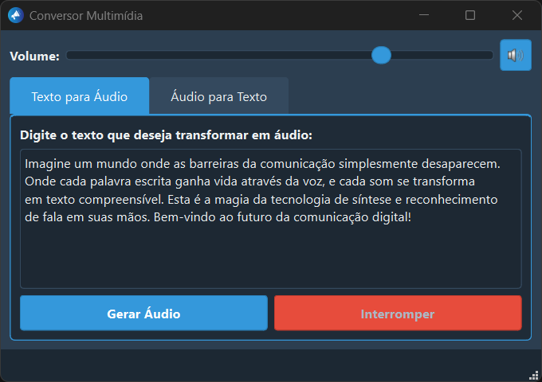

# 🎙️ Conversor Multimídia com PyQt6

<div align="center">
  
  
  **Um aplicativo desktop moderno para conversão de texto em fala e transcrição de áudio**
  
  [](https://python.org)
  [](https://www.qt.io/qt-for-python)
  [](LICENSE)
</div>

---

## 📋 Sobre o Projeto

Este aplicativo desktop oferece uma solução completa para conversão multimídia com interface moderna e intuitiva. Construído com PyQt6, apresenta um design elegante com tema escuro e efeito de vidro jateado, proporcionando uma experiência de usuário superior.

### ✨ Principais Características

- **🎨 Interface Moderna**: Design elegante com tema escuro e efeito glassmorphism
- **🔊 Síntese de Fala (TTS)**: Converta texto em áudio de alta qualidade usando Google TTS
- **🎧 Transcrição de Áudio (STT)**: Transcreva áudio para texto usando OpenAI Whisper
- **⚡ Processamento Assíncrono**: Interface responsiva sem travamentos
- **🎛️ Controles Avançados**: Controle de volume, botão mute e interrupção de reprodução
- **🌐 Suporte Multilíngue**: Detecção automática de idioma na transcrição

## 🖼️ Capturas de Tela

<div align="center">
  
### 🔊 Texto para Áudio (TTS)
*Converta texto em fala com qualidade profissional usando Google TTS*


### 📝 Áudio para Texto (STT)
*Transcreva arquivos de áudio para texto usando modelo Whisper da OpenAI*


</div>

## 🚀 Funcionalidades Detalhadas

### 📝 Texto para Áudio (TTS)
- Conversão de texto em português usando Google Text-to-Speech
- Reprodução imediata do áudio gerado
- Controle de interrupção durante a reprodução
- Feedback visual do status da operação

### 🎵 Áudio para Texto (STT)
- Transcrição precisa usando modelo Whisper (OpenAI)
- Suporte para múltiplos formatos: MP3, WAV, M4A
- Detecção automática de idioma
- Processamento otimizado para melhor performance

### 🎛️ Controles de Áudio
- **Controle de Volume**: Slider para ajuste em tempo real
- **Botão Mute**: Silenciar/ativar som com feedback visual
- **Interrupção**: Pare a reprodução a qualquer momento

## 📦 Instalação

### Pré-requisitos

- **Python 3.9+** ([Download](https://python.org/downloads/))
- **Git** (opcional, para clonagem)

### Passo a Passo

1. **Clone o repositório**
   ```bash
   git clone https://github.com/seu-usuario/conversor-multimidia.git
   cd conversor-multimidia
   ```

2. **Crie um ambiente virtual**
   ```bash
   # Windows
   python -m venv venv
   venv\Scripts\activate
   
   # Linux/macOS
   python3 -m venv venv
   source venv/bin/activate
   ```

3. **Instale as dependências**
   ```bash
   pip install -r requirements.txt
   ```

4. **Execute o aplicativo**
   ```bash
   python text_to_speech_app.py
   ```

## 📚 Dependências

| Biblioteca | Versão | Descrição |
|-----------|--------|-----------|
| **PyQt6** | Latest | Interface gráfica moderna |
| **gTTS** | Latest | Google Text-to-Speech |
| **faster-whisper** | Latest | Modelo Whisper otimizado |
| **pygame** | Latest | Reprodução de áudio |

## 💻 Uso do Aplicativo

### 🔊 Converter Texto em Áudio

1. Selecione a aba **"Texto para Áudio"**
2. Digite ou cole o texto desejado
3. Clique em **"Gerar Áudio"**
4. Use **"Interromper"** se necessário

### 📝 Transcrever Áudio

1. Aguarde o carregamento do modelo Whisper (primeira execução)
2. Selecione a aba **"Áudio para Texto"**
3. Clique em **"Selecionar Arquivo"** e escolha seu áudio
4. Clique em **"Transcrever Áudio"**
5. O texto aparecerá na área de saída

### 🎛️ Controles de Volume

- Use o **slider** no topo para ajustar o volume
- Clique no **ícone de som** para ativar/desativar o mute
- Os controles funcionam em tempo real

## ⚙️ Estrutura do Projeto

```
conversor-multimidia/
├── text_to_speech_app.py    # Aplicativo principal
├── requirements.txt         # Dependências
├── README.md               # Documentação
├── .gitignore             # Arquivos ignorados
└── megafone.png           # Ícone do aplicativo
```

## 🔧 Arquitetura

### Classes Principais

- **`MainWindow`**: Interface principal com PyQt6
- **`TextToSpeech`**: Lógica de conversão texto→áudio
- **`SpeechToText`**: Lógica de transcrição áudio→texto
- **`WorkerThread`**: Thread para processamento assíncrono

### Características Técnicas

- **Threading**: Evita travamentos da interface
- **Gerenciamento de Estado**: Controle inteligente de botões e status
- **Tratamento de Erros**: Feedback claro para o usuário
- **Otimização**: Uso eficiente de recursos do sistema

## 🎨 Personalização

O visual pode ser customizado editando a variável `STYLESHEET` no arquivo principal. O tema atual utiliza:

- **Cores Principais**: Azul (#3498db) e cinza escuro (#2c3e50)
- **Efeito Glassmorphism**: Transparências e bordas suaves
- **Tipografia**: Segoe UI para melhor legibilidade

## 🐛 Resolução de Problemas

### Problemas Comuns

**❌ Erro ao carregar o modelo Whisper**
```bash
# Solução: Reinstalar faster-whisper
pip uninstall faster-whisper
pip install faster-whisper
```

**❌ Áudio não reproduz**
- Verifique se o volume não está no mínimo
- Teste o botão mute
- Reinicie o aplicativo

**❌ Interface não carrega**
- Confirme que PyQt6 está instalado corretamente
- Verifique a versão do Python (3.9+)

## 📈 Roadmap

- [ ] **v2.0**: Suporte a mais idiomas no TTS
- [ ] **v2.1**: Exportação de transcrições (TXT, DOCX)
- [ ] **v2.2**: Gravação de áudio integrada
- [ ] **v2.3**: Configurações personalizáveis
- [ ] **v3.0**: Modo claro/escuro
- [ ] **v3.1**: Plugins de extensão

## 🤝 Contribuição

Contribuições são sempre bem-vindas! Para contribuir:

1. **Fork** o projeto
2. Crie uma **branch** para sua feature (`git checkout -b feature/MinhaFeature`)
3. **Commit** suas mudanças (`git commit -m 'Adiciona MinhaFeature'`)
4. **Push** para a branch (`git push origin feature/MinhaFeature`)
5. Abra um **Pull Request**

### Diretrizes de Contribuição

- Mantenha o código limpo e documentado
- Teste suas alterações antes de enviar
- Siga o padrão de codificação existente
- Atualize a documentação quando necessário

## 📄 Licença

Este projeto está licenciado sob a licença MIT. Veja o arquivo `LICENSE` para mais detalhes.

## 📬 Contato

Vamos nos conectar? Sou sempre aberto a discussões sobre automação, qualidade de software e modernização de sistemas!
</p>

<p align="left">
  <a href="mailto:rodrigo.melo@example.com" title="Gmail">
    
  </a>
  <a href="https://www.linkedin.com/in/rodrigo-melo-dos-santos-0262a033/" title="LinkedIn">
    
  </a>
  <a href="#" title="WhatsApp">
    
  </a>
</p>

---

<div align="center">
  <p>⭐ Se este projeto te ajudou, considere dar uma estrela!</p>
  <p>🐛 Encontrou um bug? <a href="https://github.com/seu-usuario/conversor-multimidia/issues">Reporte aqui</a></p>
</div>